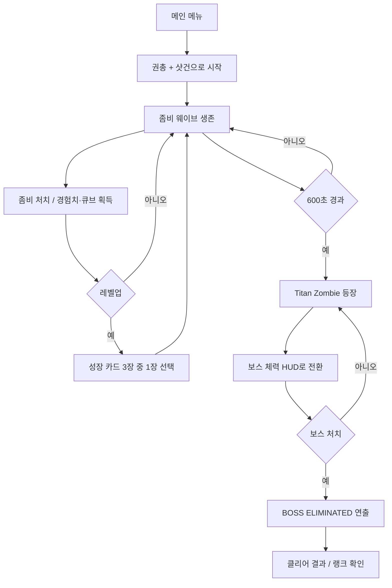
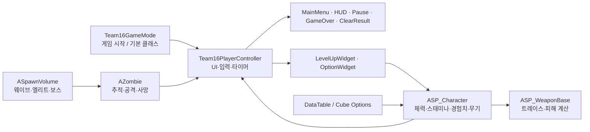

# HORDE TRIGGER

10분 동안 몰려오는 좀비를 버티고 Titan Zombie를 쓰러뜨리는 1인칭 웨이브 생존 액션

HORDE TRIGGER는 Unreal Engine 5.5와 C++·Blueprint로 만든 팀 프로젝트입니다. 플레이어는 권총과 샷건을 양손에 장착하고, 쏟아지는 좀비를 처치하며 경험치와 모듈 에너지를 모읍니다. 레벨업 카드와 큐브 옵션으로 전투 방식을 바꿔 가며 10분을 버티고, 마지막에 등장하는 Titan Zombie를 처치하면 클리어 결과를 확인할 수 있습니다.

## 프로젝트 정보

| 항목 | 내용 |
| --- | --- |
| 프로젝트 | HORDE TRIGGER |
| 개발 형태 | 팀 프로젝트 |
| 장르 | 1인칭 웨이브 생존 액션 |
| 개발 기간 | 2026.05 |
| 소속 | 내일배움캠프 |
| 엔진 | Unreal Engine 5.5 |
| 언어 | C++ · Blueprint |

## 목차

- [프로젝트 소개](#프로젝트-소개)
- [플레이 흐름](#플레이-흐름)
- [핵심 기능](#핵심-기능)
- [기술 구조](#기술-구조)
- [구현 포인트](#구현-포인트)
- [조작](#조작)
- [실행 방법](#실행-방법)
- [프로젝트 구조](#프로젝트-구조)

## 프로젝트 소개

게임을 시작하면 플레이어는 왼손에 권총, 오른손에 샷건을 들고 바로 전투에 들어갑니다. `SpawnVolume`은 플레이어 주변의 내비게이션 가능한 지점을 찾아 좀비를 생성하고, `Zombie`는 시야와 거리를 확인하며 플레이어를 추적합니다. 가까이 붙은 좀비는 공격하고, 플레이어는 이동과 사격을 조절하며 포위망을 빠져나가야 합니다.

좀비를 처치하면 경험치와 큐브를 얻습니다. 레벨이 오르면 게임이 잠시 멈추고 세 장의 성장 카드가 나타납니다. 체력·공격력·스태미나를 올릴지, 무기를 강화하거나 진화할지 선택하는 구조입니다. 큐브 메뉴에서는 모듈 에너지를 사용해 세 개의 옵션을 다시 뽑을 수 있어, 같은 무기를 사용하더라도 매번 다른 성장 방향을 만들 수 있습니다.

기본 생존 시간은 600초입니다. 600초가 지나면 일반 좀비를 정리하고 Titan Zombie가 등장합니다. 생존 타이머와 미니맵은 보스 체력 HUD로 바뀌고, 보스를 쓰러뜨리면 `BOSS ELIMINATED` 연출을 거쳐 생존 시간·처치 수·받은 피해량·랭크를 보여주는 결과 화면으로 넘어갑니다.

## 플레이 흐름



1. 메인 메뉴에서 게임을 시작합니다.
2. 플레이어 주변에 생성되는 좀비를 처치하면서 경험치와 큐브를 모읍니다.
3. 레벨업 시 게임이 일시정지되고, 현재 상태에 맞는 성장 카드 세 장이 제시됩니다.
4. 카드 선택 결과가 플레이어 능력치나 장착 무기에 적용되면 전투가 재개됩니다.
5. 큐브 메뉴에서 모듈에너지를 사용해 세 개의 옵션을 뽑고, 선택한 옵션을 양손 무기에 반영합니다.
6. 600초가 지나면 Titan Zombie와의 보스전이 시작됩니다.
7. 보스 처치 후 클리어 연출과 결과 화면을 확인합니다. 플레이어의 체력이 먼저 0이 되면 게임오버 화면으로 전환됩니다.

## 핵심 기능

### 웨이브 스폰과 좀비 AI

- `SpawnVolume`이 플레이어 주변 반경 800~1500 범위에서 위치를 고르고, NavMesh 위로 보정한 뒤 좀비를 생성합니다.
- 기본 최대 좀비 수는 30마리이며, 1초 간격으로 스폰을 시도합니다.
- 웨이브가 진행될수록 새로운 좀비 클래스를 섞어 소환하고, 30번째 스폰마다 엘리트 좀비를 배치합니다.
- 60초마다 15초 동안 광폭화가 시작되며, 이때 기존 좀비의 이동 속도가 1.5배로 증가합니다. 광폭화 중 생성된 좀비에도 상태를 적용합니다.
- 600초가 되면 일반 좀비를 정리하고 Titan Zombie를 스폰합니다.

### 양손 무기와 1인칭 사격

- `ASP_Character`의 1인칭 카메라에 왼손·오른손 무기 루트를 붙여 권총과 샷건을 독립적으로 관리합니다.
- 카메라 중앙의 화면 좌표를 월드 방향으로 변환하고, 라인 트레이스로 실제 적중 대상을 결정합니다.
- 권총과 샷건은 각각 별도의 입력 액션과 발사 지연을 사용합니다.
- 샷건과 Blast는 12개의 펠릿을 퍼뜨려 발사하고, 관통 옵션이 있으면 여러 대상을 차례로 검사합니다.
- 공격력·사거리·연사 속도·치명타·2배 피해·보스 피해·스플래시 피해 같은 보정값을 최종 피해 계산에 반영합니다.

### 레벨업 카드와 무기 성장

- `LevelUpWidget`이 플레이어의 현재 무기와 강화 상태를 확인해 성장 카드 풀을 구성합니다.
- 최대 체력, 공격력, 최대 스태미나, 체력 회복, 권총·샷건 강화 카드가 기본 선택지로 등장합니다.
- 무기 강화는 `ASP_Character::EnhanceWeapon()`으로 연결하고, 강화 단계별 데이터는 무기 DataTable에서 읽어 무기를 다시 생성합니다.
- 권총은 강화 단계와 최대 체력 조건을 만족하면 Requiem으로, 샷건은 강화 단계와 공격력 조건을 만족하면 Blast로 진화합니다.
- 카드가 닫힌 뒤에만 효과를 적용하고 게임 일시정지를 해제해, 선택 애니메이션과 실제 스탯 변경 순서를 맞춥니다.

### 큐브 옵션 시스템

- `OptionWidget`에서 모듈 에너지 5를 소모해 옵션 3개를 새로 뽑습니다.
- `URandomOptionComponent`가 Rare·Epic·Unique·Legendary 등급과 옵션 종류를 무작위로 결정합니다.
- 공격력, 연사 속도, 사거리, 경험치 획득량, 치명타 확률·피해, 관통, 큐브 획득량을 기본 옵션으로 제공합니다.
- Unique와 Legendary 등급에서는 보스 피해, 2배 피해 확률, 스플래시 피해 옵션도 등장합니다.
- 선택한 옵션은 `ASP_Character::ApplyCubeOptions()`에서 플레이어와 양손 무기의 계산에 반영합니다.

### 게임 상태와 피드백 UI

- `Team16PlayerController`가 메인 메뉴, 인게임 HUD, 일시정지, 게임오버, 레벨업, 보스 HUD, 클리어 결과의 생명주기를 한 곳에서 조정합니다.
- HUD에는 체력, 스태미나, 경험치, 레벨, 처치 수, 생존 시간이 표시됩니다.
- 보스가 생성되면 생존 타이머와 미니맵을 숨기고 보스 이름·체력바를 표시합니다. 피해를 받을 때마다 실제 체력으로 체력바를 갱신합니다.
- 피격 오버레이, 사격 효과음·파티클, 데미지 텍스트, BGM 전환, 페이드와 `BOSS ELIMINATED` 애니메이션을 연결했습니다.
- 게임오버와 클리어 결과에서는 게임을 일시정지하고 UI 입력 모드와 마우스 커서를 전환합니다.

## 기술 구조



| 계층 | 주요 클래스 | 역할 |
| --- | --- | --- |
| 게임 시작 | `Team16GameMode` | 기본 플레이어와 컨트롤러를 지정하고 메인 메뉴를 표시합니다. |
| 진행·UI | `Team16PlayerController` | 화면 전환, 입력 모드, 일시정지, 생존 타이머, 보스·결과 시퀀스를 관리합니다. |
| 플레이어 | `ASP_Character` | 이동, 시야, 스태미나, 체력, 경험치, 성장 수치와 양손 무기를 관리합니다. |
| 전투 | `ASP_WeaponBase` | 화면 중앙 조준, 라인 트레이스, 펠릿, 관통, 치명타와 최종 피해를 처리합니다. |
| 적 | `ASpawnVolume`, `AZombie` | 웨이브 스폰, NavMesh 추적, 공격, 광폭화, 사망 보상을 처리합니다. |
| 성장 UI | `ULevelUpWidget`, `UOptionWidget` | 레벨업 카드와 큐브 옵션을 생성하고 선택 결과를 플레이어에게 전달합니다. |
| 데이터 | `FGunStats`, `DT_ZombieStat` 등 | 무기 단계별 수치와 좀비 기본 능력치를 DataTable로 관리합니다. |

## 구현 포인트

### 1. 위젯마다 흩어지기 쉬운 상태를 PlayerController에 모으기

메인 메뉴, 일시정지, 게임오버, 클리어 결과는 모두 게임 정지와 입력 모드 변경을 동반합니다. 위젯마다 이 상태를 따로 바꾸면 화면을 닫은 뒤 커서가 남거나, 이전 위젯이 다시 나타나는 문제가 생기기 쉽습니다.

그래서 `Team16PlayerController`를 UI 상태의 중심으로 두었습니다. `ShowInGameHUD()`, `TogglePauseMenu()`, `ShowGameOver()`, `StartBossClearSequence()`, `ShowClearResult()`가 위젯 생성·표시, 게임 일시정지, 입력 모드, 커서 상태를 함께 처리합니다. 맵을 이동할 때도 페이드 위젯을 먼저 보여준 뒤 같은 전환 경로로 레벨을 엽니다.

### 2. 보스 HUD를 시간값이 아니라 액터 이벤트에 연결하기

보스전은 생존 타이머가 끝났다는 사실만으로는 충분하지 않습니다. 실제 보스가 생성되고, 피해를 받고, 사망하는 시점을 HUD가 따라가야 합니다.

`SpawnVolume`이 Titan Zombie를 생성할 때 `ShowHUDBossHealth()`를 호출하고, `Zombie::TakeDamage()`가 보스의 현재 체력을 `UpdateHUDBossHealth()`로 전달하도록 연결했습니다. 사망 이벤트에서는 `StartBossClearSequence()`를 한 번만 시작해 보스 처치 연출과 결과 화면으로 이어집니다. 덕분에 일반 생존 화면과 보스전 화면의 정보 우선순위를 분리할 수 있었습니다.

### 3. 성장 카드의 선택 결과를 실제 무기 수치로 이어 붙이기

성장 카드가 화면에만 머물지 않도록 카드 선택, 게임 재개, 스탯 적용, 무기 재생성을 한 경로로 묶었습니다. `LevelUpWidget`은 현재 상태에서 선택 가능한 카드 세 장을 만들고, 애니메이션이 끝난 뒤 `ASP_Character`의 강화·진화 함수를 호출합니다. 무기를 다시 생성할 때는 DataTable에서 강화 단계별 스탯을 찾아 발사 데미지와 연사 속도에 반영합니다.

## 조작

입력은 Unreal Enhanced Input 액션으로 구성되어 있으며, 실제 키는 프로젝트의 `Input Mapping Context` 에셋에서 바꿀 수 있습니다.

| 동작 | 액션 |
| --- | --- |
| 이동 | `MoveAction` |
| 시야 회전 | `LookAction` |
| 점프 | `JumpAction` |
| 달리기 | `SprintAction` |
| 왼손 무기 발사 | `LeftFireAction` |
| 오른손 무기 발사 | `RightFireAction` |
| 일시정지 | `PauseAction` |

## 실행 방법

### 요구 환경

- Windows
- Unreal Engine 5.5
- Visual Studio의 C++ 게임 개발 도구
- Git LFS

### 실행 순서

```bash
git clone https://github.com/NBcampUnrealTrack/8th-Team16-CH3-Project.git
cd 8th-Team16-CH3-Project
git lfs install
git lfs pull
```

1. `ProjectTeam16.uproject`를 Unreal Engine 5.5로 엽니다.
2. 필요한 경우 프로젝트 파일을 생성하고 C++ 모듈을 빌드합니다.
3. 에디터에서 `/Game/Modern_Gas_Station/Maps/MainLevel`을 엽니다.
4. Play In Editor(PIE)로 게임을 실행합니다.

프로젝트의 기본 맵은 `Config/DefaultEngine.ini`의 `GameDefaultMap`, `EditorStartupMap`, `ServerDefaultMap`에 설정되어 있습니다. 텍스처·맵·사운드 등 일부 에셋은 Git LFS로 관리하므로, LFS를 받지 않으면 에디터에서 리소스가 비어 보일 수 있습니다.

## 프로젝트 구조

```text
ProjectTeam16/
├─ Config/
├─ Content/
├─ Source/
│  └─ ProjectTeam16/
│     ├─ Character/      # 플레이어 이동·성장·무기 장착
│     ├─ Enemy/          # 좀비·스폰·아이템
│     ├─ Cube/           # 큐브 옵션과 등급
│     ├─ Data/           # 게임 데이터 구조체
│     ├─ Weapons/        # 발사·피해·이펙트
│     ├─ UI/             # HUD·메뉴·레벨업·결과
│     ├─ Private/        # GameMode·PlayerController 구현
│     └─ Public/         # 공용 헤더
└─ ProjectTeam16.uproject
```
